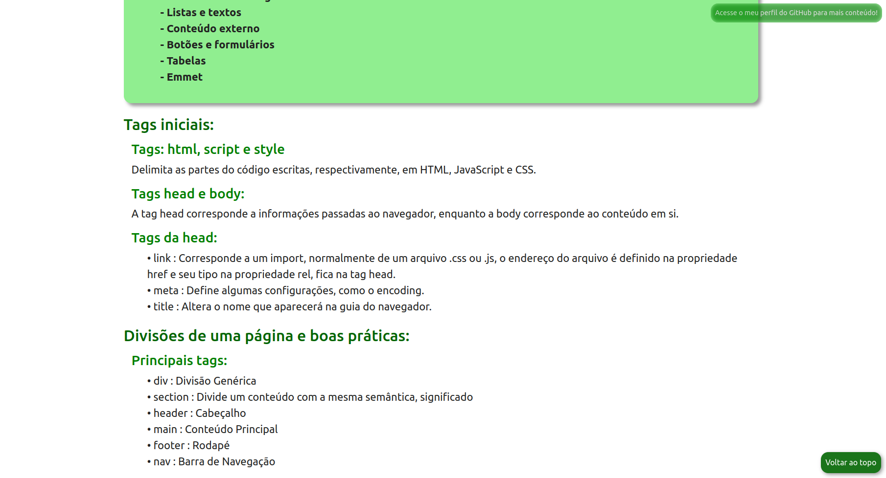
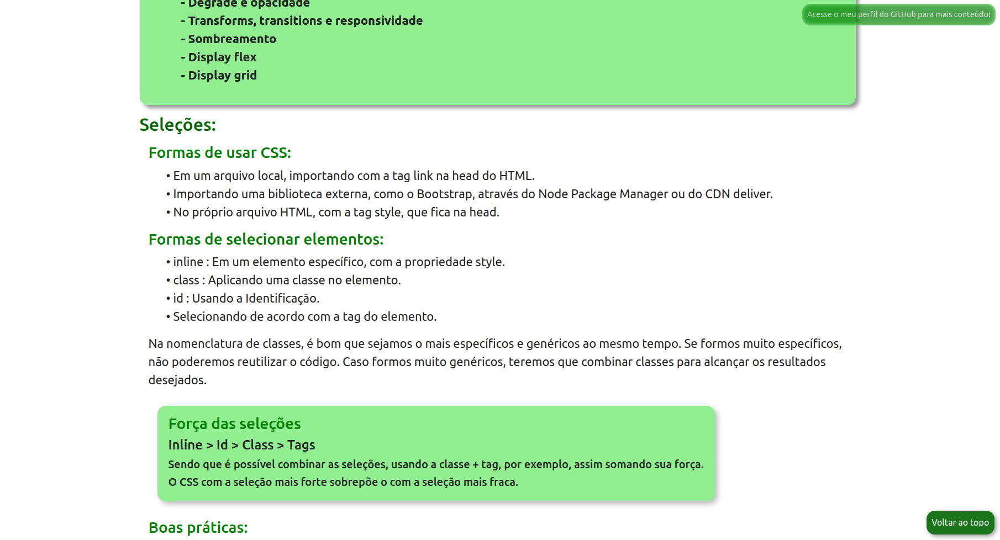
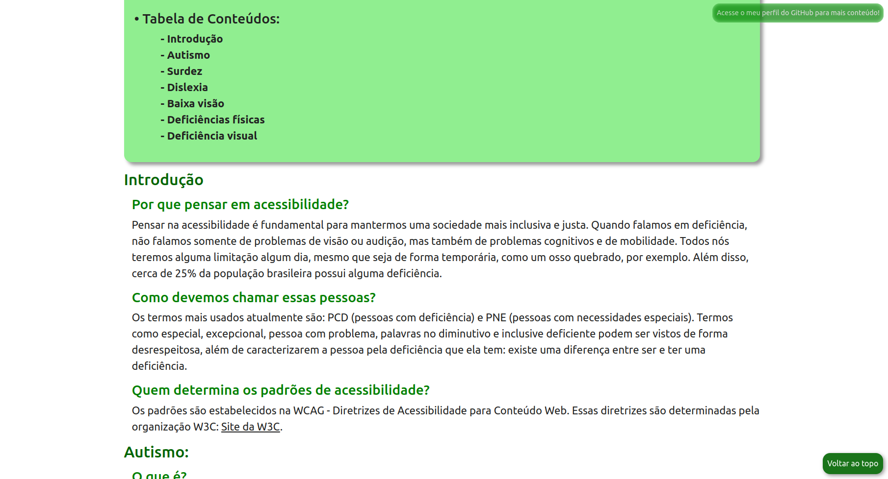

# Resumos

Páginas HTML simples para explicar o básico de HTML, CSS e acessibilidade web. Conteúdo baseado nos cursos de HTML e CSS iniciais da Alura, juntamente com os cursos de acessibilidade web.

| :placard: Vitrine.Dev |     |
| -------------  | --- |
| :sparkles: Nome        | **Resumos HTML e CSS**
| :label: Tecnologias | HTML, CSS
| :rocket: URL         | <https://brenomorim.github.io/resumo-html-css/>

## Detalhes do Projeto

Vários conteúdos são abordados, na página com o resumo de HTML temos as principais tags de listas, textos, divs e variações, tabelas, formulários e até sobre Emmet. No resumo de CSS falo sobre seletores, cores, medidas, displays, flex, grid, responsividade, sombras, pseudo classes e pseudo elementos. Sobre acessibilidade abordo temas relacionados às boas práticas para os principais tipos de necessidades especiais, como autismo, dislexia, baixa visão, deficiências físicas e entre outros.

## Conteúdos

### HTML

- Tags iniciais
- Divisões de uma Página
- Listas e textos
- Conteúdo externo
- Botões e formulários
- Tabelas
- Emmet

---

### CSS

- Seleções
- Cores, medidas e espaçamentos
- Texto e fonte
- Pseudoclasses e elementos
- Display e posicionamento
- Degradê e opacidade
- Transforms, transitions e responsividade
- Sombreamento
- Display flex
- Display grid

---

### Acessibilidade

- Introdução
- Autismo
- Surdez
- Dislexia
- Baixa visão
- Deficiências físicas
- Deficiência visual

---
